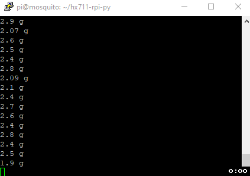

# Raspberry Pi HX711 Python Bindings

[](https://github.com/endail/hx711-rpi-py/actions/workflows/build_and_upload.yml)

Python bindings for [Raspberry Pi HX711 C++ Library](https://github.com/endail/hx711)

- Use with Raspberry Pi
- Read from a HX711 using Python
- Code tested inside [virtual Raspberry Pi Zero/3/4 environments](.github/workflows/build_and_upload.yml) on GitHub and builds automatically uploaded to PyPI

## Sample Output



The .gif above illustrates the output of a [simple Python script](src/test.py) on a Raspberry Pi Zero W where the HX711 chip was operating at 80Hz. In this example, each time the `.weight` function is called the median of three samples was used to calculate the weight in grams.

## Examples

### SimpleHX711 Example

```python
from HX711 import *

# create a SimpleHX711 object using GPIO pin 2 as the data pin,
# GPIO pin 3 as the clock pin, -370 as the reference unit, and
# -367471 as the offset
hx = SimpleHX711(2, 3, -370, -367471)

# set the scale to output weights in ounces
hx.setUnit(Mass.Unit.OZ)

# constantly output weights using the median of 35 samples
while True:
    print(hx.weight(35)) #eg. 1.08 oz
```

### AdvancedHX711 Example

```python
from HX711 import *
from datetime import timedelta

# create an AdvancedHX711 object using GPIO pin 2 as the data pin,
# GPIO pin 3 as the clock pin, -370 as the reference unit, -367471
# as the offset, and indicate that the chip is operating at 80Hz
hx = AdvancedHX711(2, 3, -370, -367471, Rate.HZ_80)

# constantly output weights using the median of all samples
# obtained within 1 second
while True:
    print(hx.weight(timedelta(seconds=1))) #eg. 0.03 g
```

## Install

1. Install [libhx711](https://github.com/endail/hx711). Optionally, you can use [this script](src/install-deps.sh).

2. `pip3 install hx711-rpi-py`

## Calibrate

There is a Python script in the `src` directory you can use to calibrate your load cell and obtain the reference unit and offset values referred to above. The simplest way to use it after installing `hx711-rpi-py` is as follows:

```console
pi@raspberrypi:~ $ wget https://github.com/endail/hx711-rpi-py/blob/master/src/calibrate.py
pi@raspberrypi:~ $ python3 calibrate.py
```

When you no longer need it, simply `rm calibrate.py` to remove the calibration script.

## Documentation

As the Python code relies upon the [underlying C++ library](https://github.com/endail/hx711#documentation), the documentation is identical. However, not all of the code is exposed to Python. An example is the [Utility class](https://github.com/endail/hx711/blob/master/include/Utility.h), which is only meant for use within the C++ library. You can check precisely which functionality is accessible through Python in the [bindings.cpp file](src/bindings.cpp).
